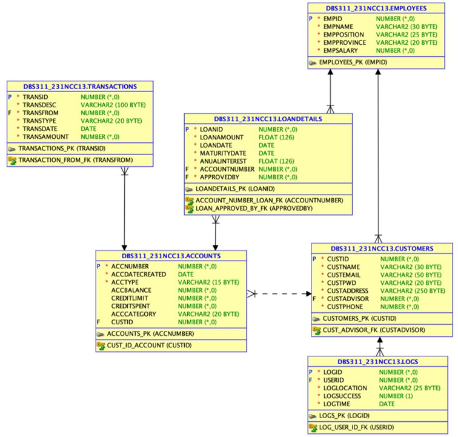

# Account-Pro
Account-Pro is a comprehensive solution designed to manage various banking functions, including customer accounts, loan details, employee records, transaction histories, and system logs. It leverages PL/SQL stored procedures and C++ functionalities to efficiently handle customer interactions, track transactions, monitor loan details, and ensure secure system operations. The system is structured around multiple interrelated tables, allowing the bank to manage data effectively and maintain relationships across different entities such as employees, customers, accounts, and loans.

### Key Relationships
- **Employees to Customers**: One-to-Many
- **Customers to Logs**: One-to-Many
- **Customers to Accounts**: One-to-Many
- **Accounts to LoanDetails**: One-to-Many
- **Employees to LoanDetails**: One-to-Many
- **Accounts to Transactions**: One-to-Many

## Database Structure

### Tables
- **Employees**: Stores employee information.
- **Customers**: Manages customer details.
- **Logs**: Records user interactions.
- **Accounts**: Tracks customer accounts.
- **LoanDetails**: Maintains loan information.
- **Transactions**: Logs transaction details.

### Relationships
- Comprehensive relational structure ensures efficient data management and integrity.

### Diagram

## Stored Procedures

### Employee Management
- Retrieve, insert, update, and delete employee data.

### Customer Operations
- Add, update, and delete customer records.
- Fetch customer details based on specific criteria.

### Loan Processing
- Insert, update, delete, and retrieve loan information.

### Transaction Management
- Handle account transactions with detailed tracking.

### Activity Logs
- Insert, update, and delete activity logs for enhanced security and auditing.

## Technology Stack
- **Language**: PL/SQL
- **Database**: Relational Database Management System (RDBMS)
- **Key Concepts**: Stored Procedures, Relationships, Error Handling

## Installation and Setup
1. Clone the repository.
2. Import the database schema and populate initial data.
3. Deploy stored procedures.
4. Connect to the database using a compatible client.

## Usage
- Utilize the stored procedures for performing CRUD operations on employees, customers, accounts, loans, transactions, and logs.
- Execute queries to retrieve and analyze data for administrative and operational purposes.

## Error Handling
- Error codes ensure consistent feedback for operations:
  - `-1`: General error.
  - `-2`: No data found.
  - `-3`: Too many rows returned.

